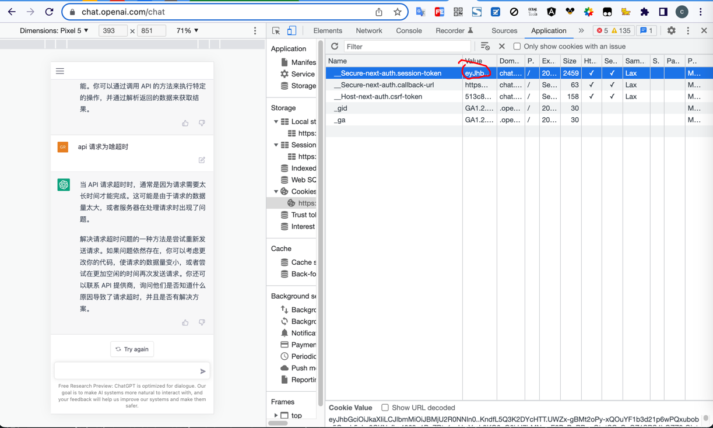
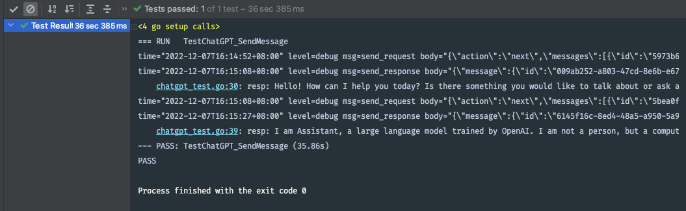

# ChatGPT golang 接口对接

## 运行测试

1. 已经登录好的 ChatGPT 账号
从登录好的网站 https://chat.openai.com/chat 控制台获取 __Secure-next-auth.session-token session 的值

2. 设置程序测试的环境变量
SESSION_KEY={上边获取到的 cookie 值}
3. 运行测试代码 go test -run TestChatGPT_SendMessage
